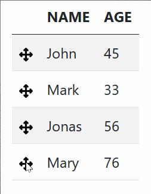
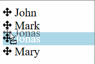

<!-- markdownlint-disable MD033 -->

# svelte-sortable-items

    [](https://twitter.com/joaquimnetocel)

svelte-sortable-items is a svelte/sveltekit package to create sortable drag-and-drop items. This package allows you to relate a javascript array to sortable HTML elements.

<p style="display:flex;align-items:center;justify-content:center;gap:30px;">
  
  
</p>

## WHY ANOTHER SVELTE PACKAGE FOR SORTING?

**svelte-sorting-items** differs from other svelte sorting packages by not committing to a specific html structure (like "ul/li" lists). Furthermore, it promotes sorting from the child elements only, instead of sorting the children of a parent element. This allows a non-opinionated structure/styling and, consequently, the ordering of more flexible structures, such as the lines of a table for example.

## FEATURES

- NON-OPINIONATED STYLING.
- NON-OPINIONATED HTML STRUCTURE.
- TYPESCRIPT SUPPORT.

## DEMOS

- [REPL: BOOTSTRAP 5 TABLE EXAMPLE](https://svelte.dev/repl/b6ac15d832194ccca959961269434d7f)
- [REPL: SKELETON EXAMPLE](https://svelte.dev/repl/f00d587a19af40899cdfccfb9a733f23)

## INSTALLATION

```bash
npm install svelte-sortable-items
```

## COMPONENT STRUCTURE

- `SortableItem`: A component to create sortable html elements.
- `MoveIcon`: An icon commonly used to sort items.

## PROPS

- PROPS OF `SortableItem`:

| PROP | DESCRIPTION | TYPE | REQUIRED | DEFAULT |
| - | - | - | - | - |
| `propData` | AN ARRAY WITH THE DATA. | `Generic[]` | YES | - |
| `propItemNumber` | THE INITIAL POSITION OF THE ITEM. | `number` | YES | `undefined` |
| `propHoveredItemNumber` | THE HOVERED ITEM NUMBER (GENERALY USED TO DO SPECIFIC STYLING WHEN HOVERING). | `number` | NO |  |

- PROPS OF `MoveIcon`:

| PROP | DESCRIPTION | TYPE | REQUIRED | DEFAULT |
| - | - | - | - | - |
| `propSize` | SIZE OF THE SORT ICON  | `number` | NO | 12 |

## EXAMPLES

- SKELETON EXAMPLE:

```svelte
<script>
    import { MoveIcon, SortableItem } from 'svelte-sortable-items';
    import { flip } from 'svelte/animate';

    // STATES
    let arrayUsers = [
        { id: 1, name: 'John', age: 45 },
        { id: 2, name: 'Mark', age: 33 },
        { id: 3, name: 'Jonas', age: 56 },
        { id: 4, name: 'Mary', age: 76 }
    ];
    let numberHoveredItem;
    /////
</script>

<p>MOVE THE <MoveIcon propSize={12} /> ICON TO REORDER ELEMENTS.</p>

{#each arrayUsers as currentUser, numberCounter (currentUser.id)}
    <div animate:flip>
        <SortableItem
            propItemNumber={numberCounter}
            bind:propData={arrayUsers}
            bind:propHoveredItemNumber={numberHoveredItem}
        >
            <div class:classHovered={numberHoveredItem === numberCounter}>
                <MoveIcon propSize={12} />
                {currentUser.name}
            </div>
        </SortableItem>
    </div>
{/each}

<style>
    .classHovered {
        background-color: lightblue;
        color: white;
    }
</style>
```

- BOOTSTRAP 5 TABLE EXAMPLE:

```svelte
<script>
    import { MoveIcon, SortableItem } from 'svelte-sortable-items';
    import { flip } from 'svelte/animate';

    // STATES
    let arrayUsers = [
        { id: 1, name: 'John', age: 45 },
        { id: 2, name: 'Mark', age: 33 },
        { id: 3, name: 'Jonas', age: 56 },
        { id: 4, name: 'Mary', age: 76 }
    ];
    let numberHoveredItem: number;
    /////
</script>

<!-- BOOTSTRAP -->
<svelte:head>
    <link
        href="https://cdn.jsdelivr.net/npm/bootstrap@5.0.2/dist/css/bootstrap.min.css"
        rel="stylesheet"
        integrity="sha384-EVSTQN3/azprG1Anm3QDgpJLIm9Nao0Yz1ztcQTwFspd3yD65VohhpuuCOmLASjC"
        crossorigin="anonymous"
    />
</svelte:head>
<!---->

<div class="px-4">
    <div>MOVE THE TABLE ROWS TO REORDER:</div>
    <table class="table table-striped w-auto">
        <thead>
            <tr>
                <th />
                <th>NAME</th>
                <th>AGE</th>
            </tr>
        </thead>
        <tbody>
            {#each arrayUsers as currentUser, numberCounter (currentUser.id)}
                <tr animate:flip class:classHovered={numberHoveredItem === numberCounter}>
                    <td>
                        <SortableItem
                            bind:propData={arrayUsers}
                            propItemNumber={numberCounter}
                            bind:propHoveredItemNumber={numberHoveredItem}
                        >
                            <MoveIcon propSize={15} />
                        </SortableItem>
                    </td>
                    <td>
                        <SortableItem
                            bind:propData={arrayUsers}
                            propItemNumber={numberCounter}
                            bind:propHoveredItemNumber={numberHoveredItem}
                        >
                            {currentUser.name}
                        </SortableItem>
                    </td>
                    <td>
                        <SortableItem
                            bind:propData={arrayUsers}
                            propItemNumber={numberCounter}
                            bind:propHoveredItemNumber={numberHoveredItem}
                        >
                            {currentUser.age}
                        </SortableItem>
                    </td>
                </tr>
            {/each}
        </tbody>
    </table>
</div>

<style>
    .classHovered {
        background-color: lightblue;
        color: white;
    }
</style>
```

## DEVELOPING

Once you've created a project and installed dependencies with `npm install`, start a development server:

```bash
npm run dev
```
